# Wazuh SIEM Installation on Ubuntu Server 22.04

### Lab Work
**Student Name:** Ragib Shahriar Abeg  
**Student ID:** 2304017
**Course Name:** Threat Modelling and Security Monitoring Sessional  
**Course Code:** SEC 203
**Submitted to:** Masud Rana (Lecturer)

---

## Objective
To install and configure **Wazuh** (Open Source Security Monitoring Platform) on **Ubuntu Server 22.04 LTS** using VirtualBox and access it via PuTTY and Web Dashboard.

---

## Tools & Technologies Used

- **Virtualization:** Oracle VirtualBox
- **Operating System:** Ubuntu Server 22.04.5 LTS
- **SIEM Tool:** Wazuh 4.12.0
- **SSH Client:** PuTTY
- **Browser:** Mozilla Firefox

---

## Lab Steps

### 1. Download Ubuntu Server ISO
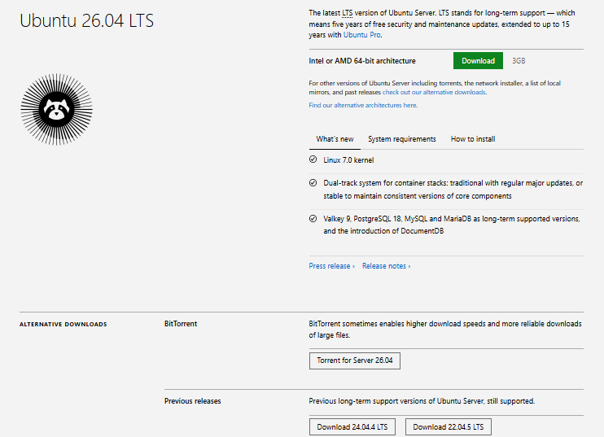

### 2. Create Virtual Machine in VirtualBox
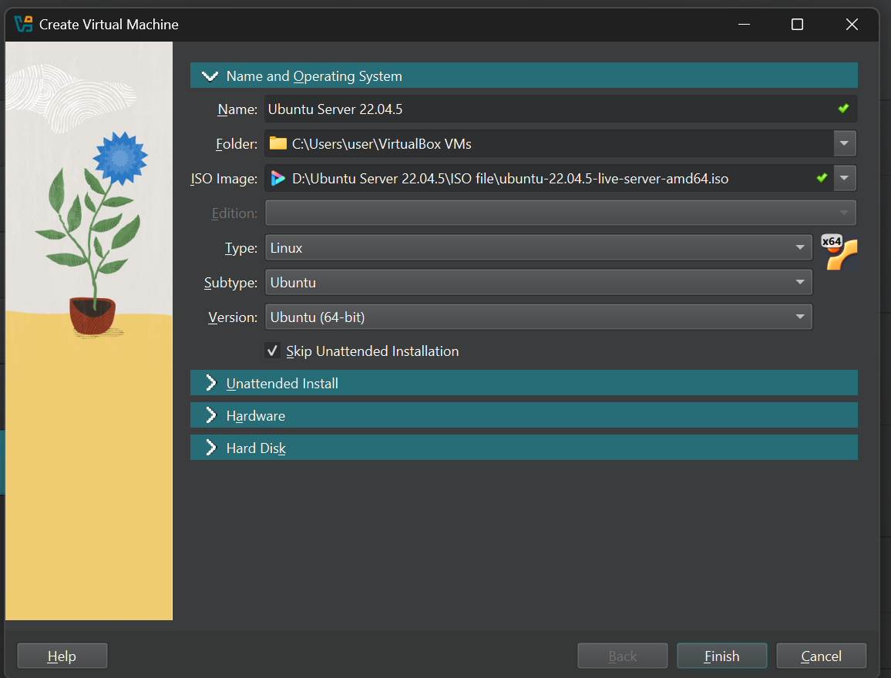

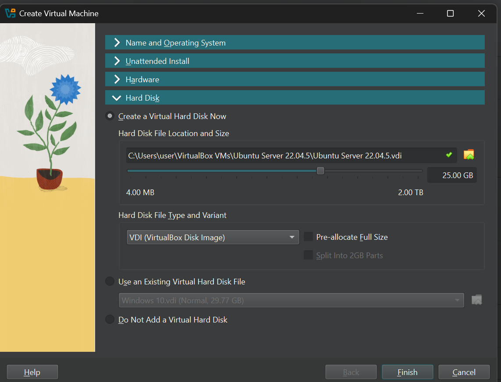

### 3. Ubuntu Server Installation
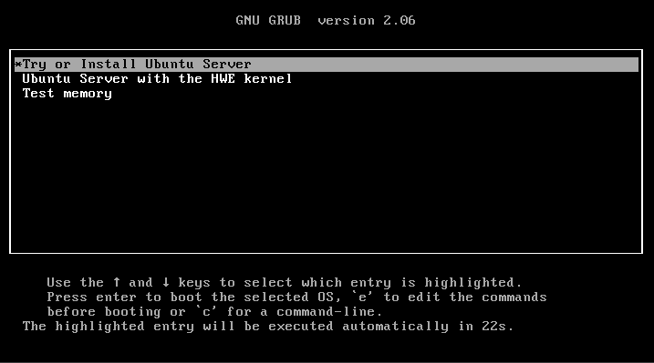
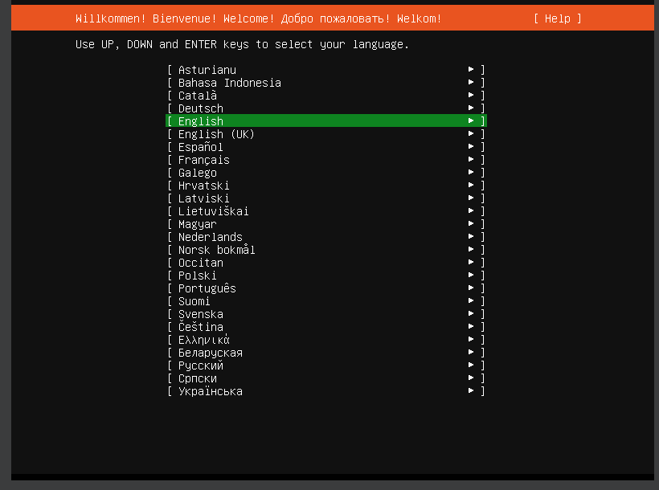
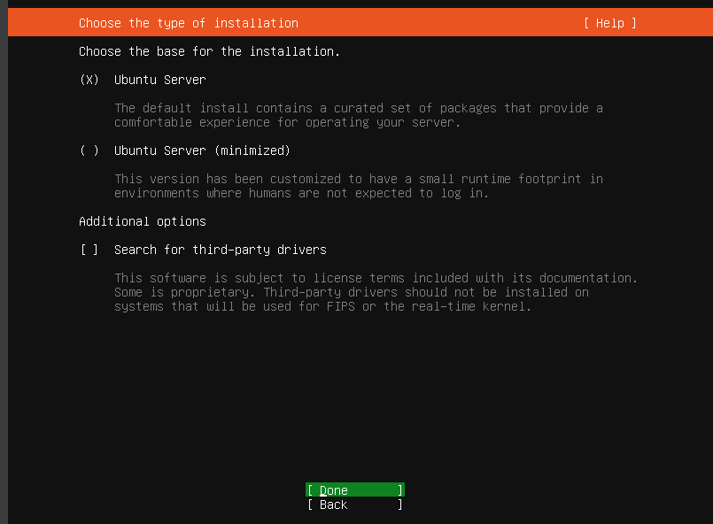
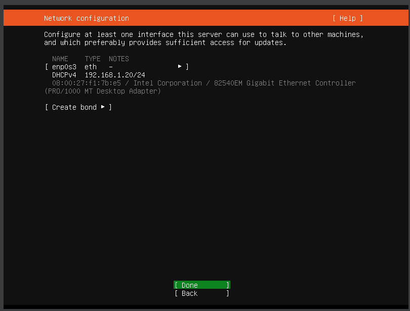
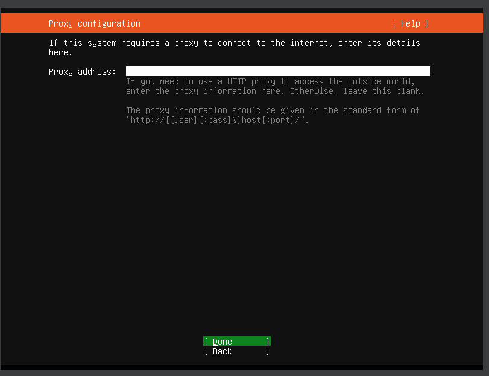
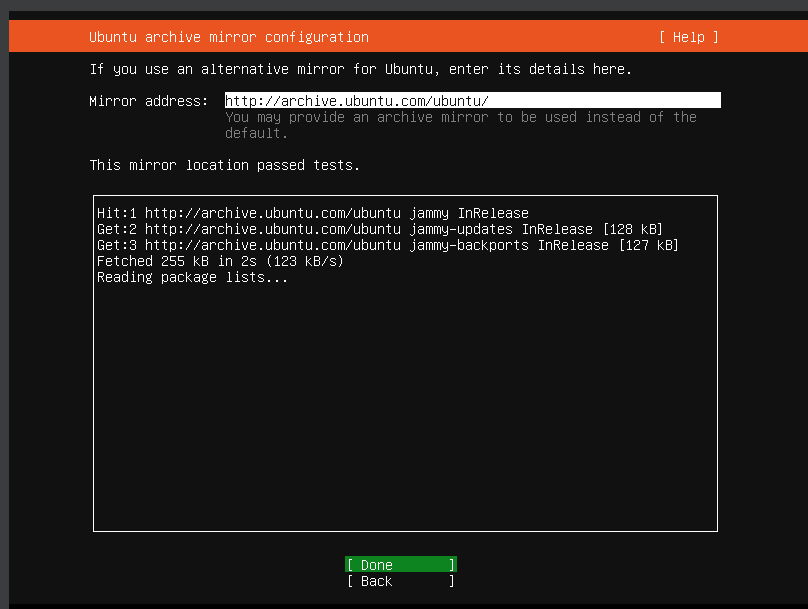
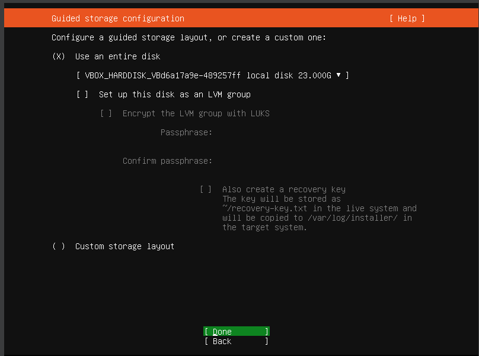
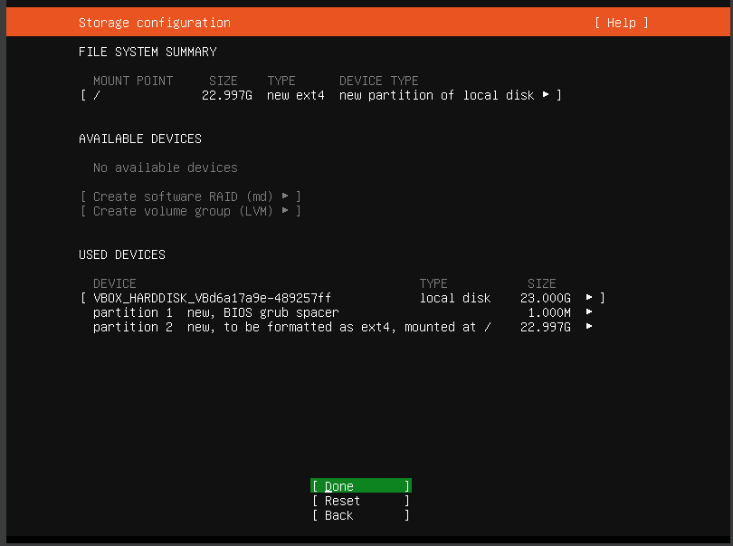

### 4. Post Installation & PuTTY Connection
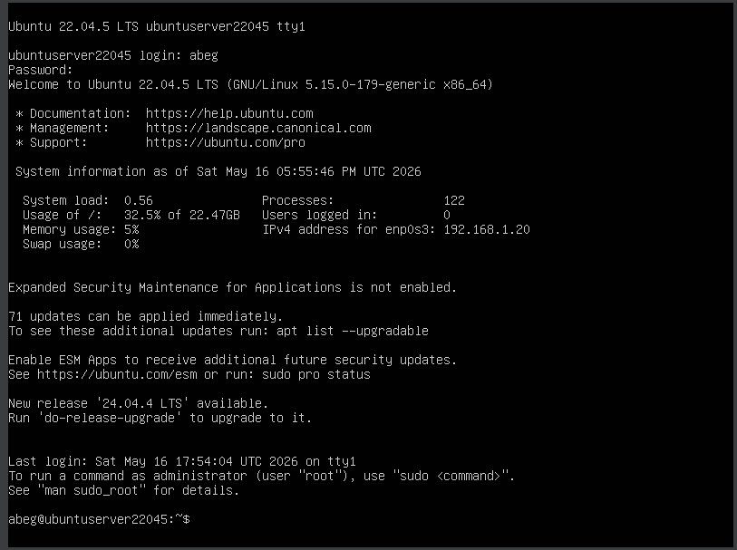
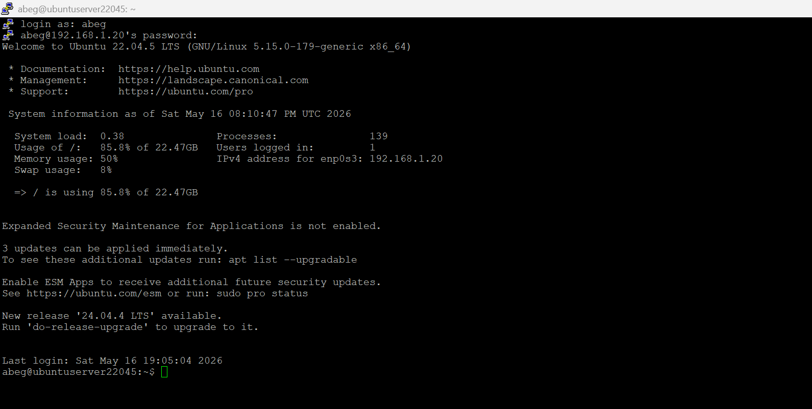
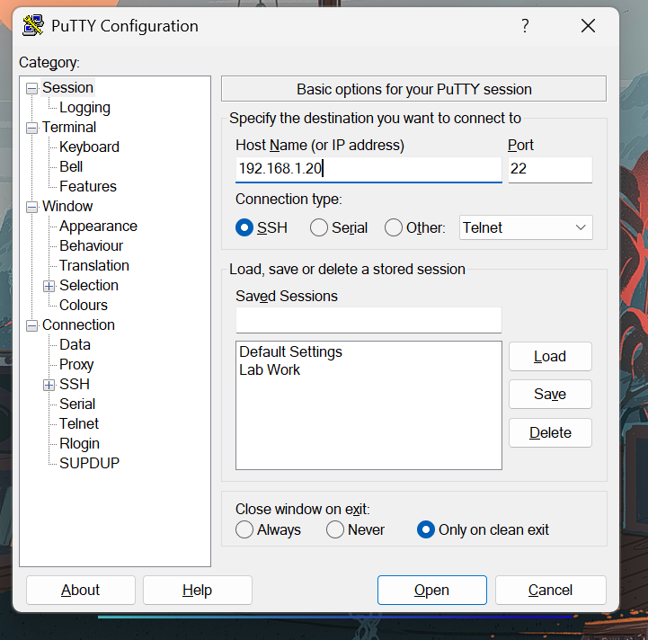

### 5. Wazuh Installation
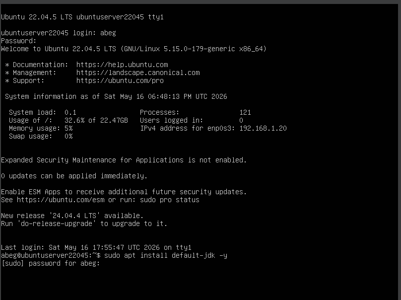
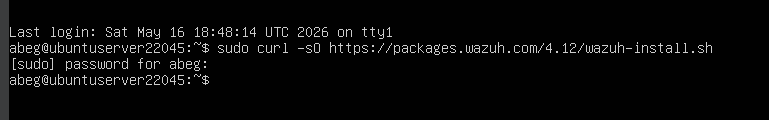
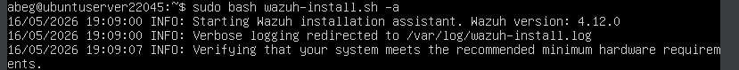
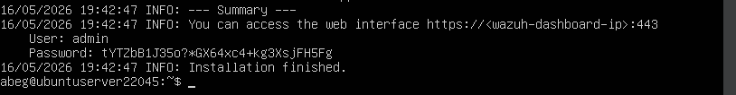

### 6. Network & Access
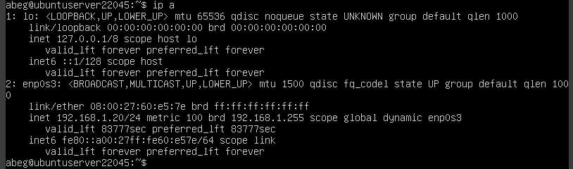

### 7. Wazuh Dashboard Access
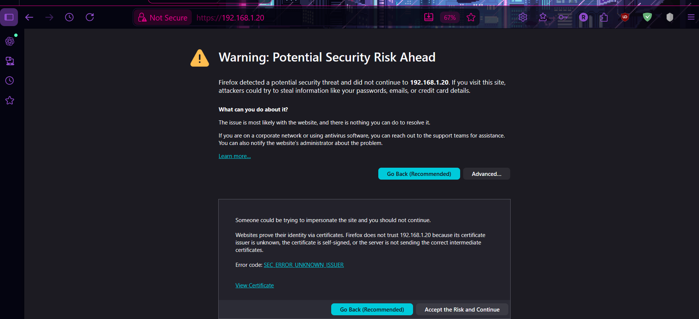

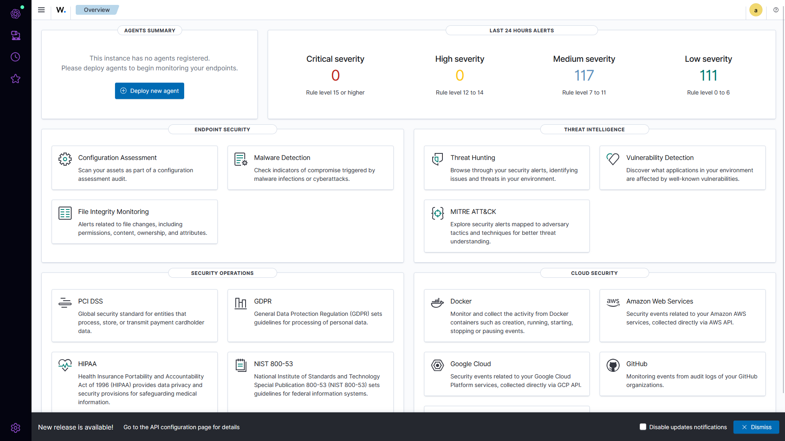

### 8. Services Status
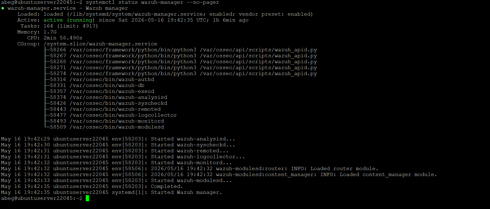
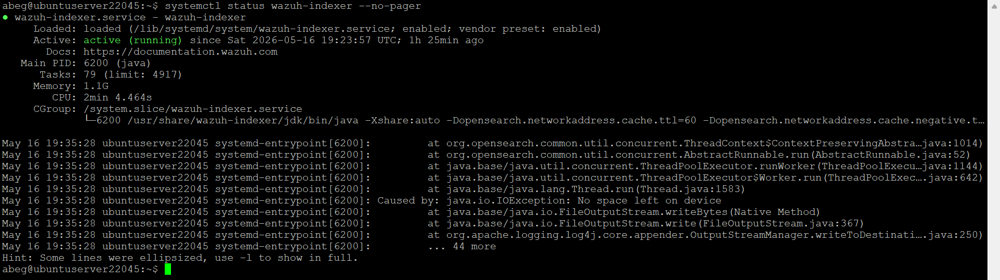
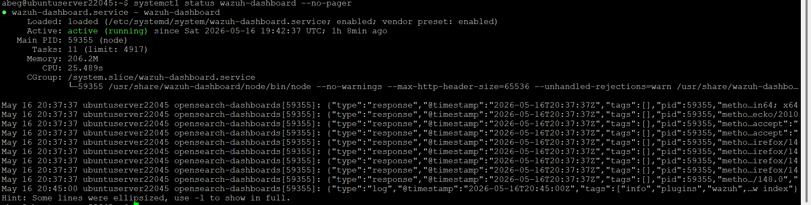

---

## Key Achievements

- Successfully installed **Ubuntu Server 22.04.5 LTS** on VirtualBox
- Configured SSH access using **PuTTY**
- Installed **Wazuh 4.12.0** (All-in-One deployment)
- Wazuh Manager, Indexer, and Dashboard are **Active & Running**
- Successfully accessed Wazuh Web Dashboard

---

## Commands Used

- `ip addr show` / `hostname -I` → Check IP Address
- `sudo curl -sO https://packages.wazuh.com/4.12/wazuh-install.sh`
- `sudo bash wazuh-install.sh -a`
- `systemctl status wazuh-manager`
- `systemctl status wazuh-indexer`
- `systemctl status wazuh-dashboard`

---

## Conclusion

This lab successfully demonstrated the deployment of a full **Wazuh SIEM** stack on Ubuntu Server. The system is now ready for monitoring endpoints, detecting threats, and performing security analysis.

---

**Submitted by:**  
**Ragib Shahriar Abeg**  
**ID: 2304017**
